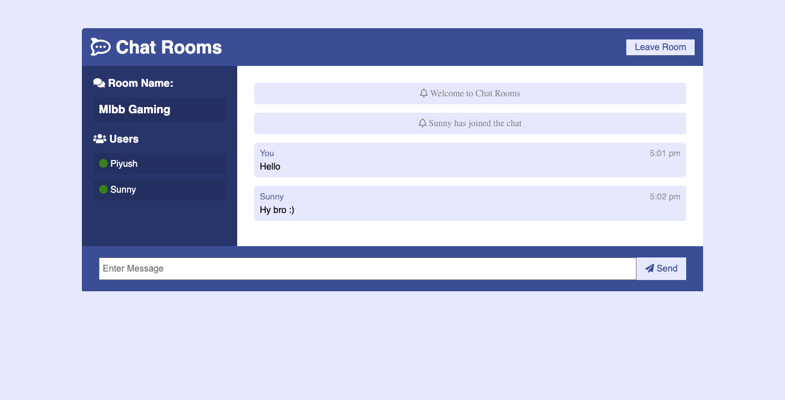

# Chat-Rooms
Realtime chat rooms with WebSockets using Node.js, Express and Socket.io with Vanilla JS on the frontend.


# :zap: Installation
1. Clone / Download this repo.
2. Inside the project open a terminal and run:
```bash
npm install
```
3. To start the development server run:
```bash
npm run dev
```
4. Go to localhost:3000
